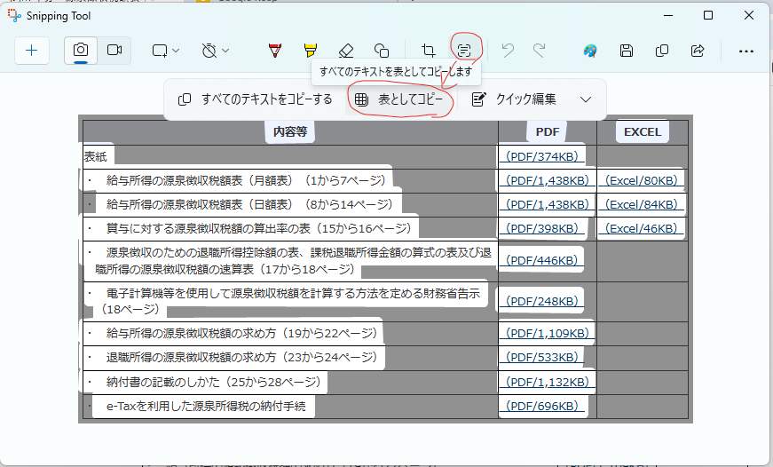
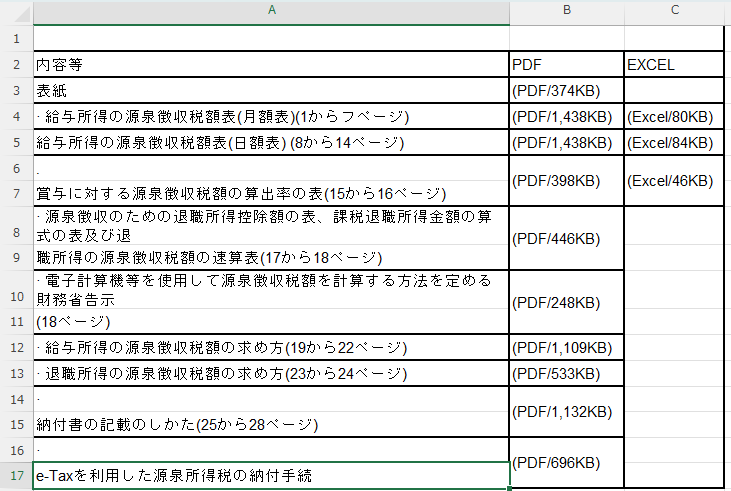

今週の気になった言葉４

知っていると**ほんのちょっと、本当にほんのちょっとだけ**得をする。そんな知識をいくつかピックアップして紹介する。

# 電車も「左側通行」
日本の鉄道は基本的に左側通行です。これを知っていると、入線してくる電車がどちらから来るのかがパッと想像できるようになる。

ホームに停まっている電車がどちらに動き出すのかも判別できるので、発車ギリギリにホームへ駆け込み「どっちに乗ればいい！？」と迷ったとき、命拾いする可能性が高くなる。

※もちろん例外はあります。

# 「メタバース」のアクセント
最近この言葉使ってる人いないけど、「メタバース」というのは「ユニバース」をもじった言葉なんです。
だからアクセントもユニバースと同じく先頭「メ」に置くのが正解。頭高に発音するのが通な感じ。

# Snipping Toolは「表」もいける
「Shift+Win+S」で画面キャプチャが撮れるのは知っている人が多いと思うけど、実は文字認識だけでなく「表認識」もしてくれる。精度はイマイチだけど、手入力とかになるよりはだいぶマシ。

Snipping Toolを起動して、「テキスト アクション」のボタンをクリック。少し待つと、「表としてコピー」というメニューが出るのでそれを選択。そうするとクリップボードにコピーされる。

エクセルに貼り付けるとこんな感じ。

これは上の２つと比べると圧倒的に実用的かもしれん。

# 「日経クロスワード」が無料で公開されてる
日経クロスワードというのがあって、日経新聞日曜版に掲載されているクロスワードである。これがとても難しい。たぶん今想像している数倍むずかしい。例えるなら「ほのぼのした絵柄で鬼畜な難易度を誇るサイゼリヤの間違い探し」のクロスワード版といったところか。
たまに一つもわからないという回もあり、知識というよりネットの検索力を問われているのではと思うほど。

知識ですべて埋めることはほぼ不可能。そのため、知ってる言葉があるだけでインテリ心をくすぐられる気持ちよさもある。

公式Web上で無料でできる。
https://vdata.nikkei.com/nikkeithestyle/crossword/
解答はないけど全部埋めた後の正誤判定はしてくれます。
