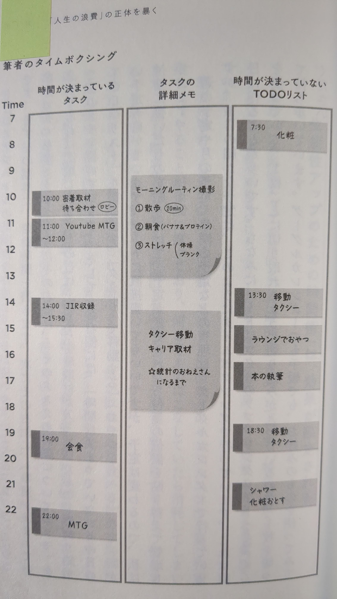
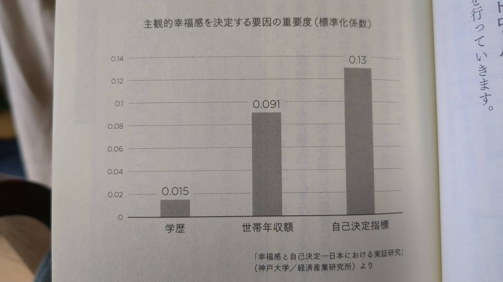

# 効率的な時間の使い方というか、後悔しない生き方について

サトマイというyoutuberの書いた本「あっという間に人は死ぬから」という本を読んで、良い本だと思ったのでまとめようと思う。

youtuberが書いたビジネス書というカテゴリなので、あっという間に読み終わるかと思いきや、意外や意外なかなか重くて油断していると振り落とされかねません。
データサイエンティストということもあって、出展のない怪しげなビジネス理論を振りかざすこともありません。

冒頭で「時間がない」という認知について述べていて、そこから急に、死・孤独・責任という３つの理に対する捉え方に原因があるとする論理展開は、一瞬何がおきたのかわからなくなるトンデモな論理展開に思えますが、ちゃんと読むとたしかにそうかも知れないと思わされるものでした。

## 人生の浪費の正体
世の中の効率化のハウツーについては生産性アップ系と自己啓発系の２つある
### 生産性アップ術
Top10は以下の通り
| No | Technique              | Practicality | Difficulty | Effect         |
|----|------------------------|--------------|------------|---------------|
| 1  | Time-boxing           | 100          | 3          | 時間管理      |
| 2  | Prioritise            | 97.5         | 3          | 時間管理      |
| 3  | Say no                | 91.3         | 2          | well-being向上 |
| 4  | Move!                 | 82.6         | 3          | well-being向上 |
| 5  | Control your devices  | 82.6         | 3          | 通知管理      |
| 6  | Take short breaks     | 78.2         | 2          | well-being向上 |
| 7  | To-do lists           | 69.6         | 2          | 目標達成      |
| 8  | Eat well              | 69.6         | 3          | well-being向上 |
| 9  | 2-minute rule         | 69.6         | 2          | 時間管理      |
| 10 | Control social media  | 65.2         | 3          | 通知管理      |

この中でもNo.1のTime-boxingの方法について筆者は、googleカレンダー＋当日分を前日に作成(切り離せるノートに付箋を貼り付けている)するという運用をしている。  

とはいえ、仕事内容は変わっていないので効果は限定的である。

### 自己啓発系のテクニック
緊急度×重要度であらわされたアイゼンハワーマトリクス[^1]が有名であるが、そのうち「緊急ではないが重要なこと」に意識的に時間を使うようにする。重要でないことは緊急・緊急でないにかかわらずしない。

[^1]: 7つの習慣 スティーブン・R・コビー著

時間のコントロールではなく、集中力のコントロールが大事なのだ。締め切りがある。おかげで集中力が出るのだ  

とはいえ
①人間は同じ作業1日中することはできない。  
②人間は1日の中で体の動きが活発な活動と静かな活動を複数レベルに分けて自動配分しており、活発な活動は静かな活動より多く時間を使うことはできない。  
③人によって平均的な活動度は異なるが、①と②の条件は誰もが同じ。　　

したがって時間の使い方のコントロールは現実的には難しいということになる。

## 本当の課題は時間の使い方ではない
- 自分にとって大切なやるべきことを把握する
- 遂行する上での邪魔者を理解する

### 時間の浪費の正体
ここで、人生の３つの理、①死、②孤独、③責任を避けるために無意識に自分に嘘をついて行っている行動が間違った時間の使い方を生み出している。

①死の不安→何かに没頭  
②孤独の不安→友人やパートナーを求める  
③責任の不安→他人に決めてもらう  
これらが、それぞれ
→ゲームで日常生活に支障  
→浮気を繰り返す  
→他人の評価に振り回される
さらに自己欺瞞をしてしまう。傷つきたくないから。

これらにより本命の行動ではなく代替の行動に時間とお金を浪費している
例：
* 旅行資金がたまったら海外に行こうと仕事を頑張って、すでに5年経っている
* 最高のパートナーが欲しいけど自身がないので、とりあえず体を鍛えて早1年
* ビジネス書やセミナーで勉強し続けて、万年起業準備中
など

###　幸福とは
健康・人間関係に次ぐ因子として、所得・学歴よりも自己決定が上  

**この章の結論**  
「有意義な時間の使い方」とは、自分の人生の舵を自分で握ることとその覚悟。
そして智慧を手に入れ、人生の３つの理(死・孤独・責任)を受け入れながら、自分の人生をコントロールすること

## 、人生の３つの理(死・孤独・責任)と向き合う
### 苦痛からは逃れられないという前提
苦痛から逃れようとすると、かえって悪化するケースが多い。  
①「考えない」と思うとより考えてしまう[^2]  
②「元気だして！」は逆効果  
③笑うと前向きになる、は真意不明

[^2]: シロクマのリバウンド効果

### 苦痛への対応3つの原則
#### １．変えられないものと変えられるものを区別する
#### ２．人生に対して主体的に参加せよ
幸福度の決定要因は、遺伝が50%、生活環境が10%、40%が意図的な行動で説明できるとのこと[^3]

[^3]:https://sonjalyubomirsky.com/

意図的な行動とは、自分の価値観に沿った内的で習慣的な行動のことです。

#### ３．人生に苦は必要である
これまで払ってきたコスト(時間・労力・お金)の総量が、幸福感を高める傾向がある。これを心理学では「努力のパラドクス」という。

充実する時間の使い方(努力のしどころ)は、
- 自分で変えられることに集中する
- 自分の価値観など内的な動機をを大切にし、行動する
- ストレスを自身の成長の糧にする

#### 自分で変えられることとは
認知と行動は変えられるが、感情や身体反応は変えられない

物理的な温かさが人物評価に影響をあたえるといったように、体で感じ取った情報が、認知情報処理にも影響することを身体的認知という。(お店の回転率をあげるためにアップテンポな曲をかけるなど)

##### 否定的な自動思考
過去の経験などからネガティブな認知の歪みが生まれる。誰しも持っているものだが、それが、負の成就予言に繋がってしまう。
問題解決している例[^4]を見ることで改善できるかも

[^4]:1mile走を4分切れないと思われていたが、4分を切った選手が現れたことで次々とクリアされていった。

特に、神経症傾向の人(過度に不安)とドーパミン中毒の人(過度な楽観・確証バイアス)は認知がゆがみやすい。ドーパミン中毒は最近ではスマホ(SNS, ソシャゲ, web広告）が引き起こす。

##### 一時的な不快な「体験回避」
テスト勉強を避けるとか、講演会で質問したいがはずかしくてできなかったとか。
苦痛を避けることで、自分の人生の質が長期的に下がってしまう。

#### エクスポージャー法で解決
認知行動療法というように、行動が大事。不安に感じる状況にあえて身を置き、**少しずつ**認知の歪みを正していく。

##### 恥や嫉妬はなぜおこるのか
集団から排除されるという不安「社会的感情」
カーネギーによると人を動かす唯一の方法は「相手の自己重要感を満たす」こと。

#### うまくいかない原因を考える
苦痛の原因は複雑で複数の要素が絡んでいるので考えるだけ無駄。
遺伝子に組み込まれた不安センサーは制度が悪く、ミシガン大学の研究によると、心配事の80%、準備していれば96%は起こらない。

#### メンタルにいい変化をもたらす方法
1. 気づく(mindfullness)  
ここで起きている出来事、自分の感情、認知、行動、身体反応  
週に5日10分瞑想するだけでも注意力のコントロールができるというエビデンスあり
2. 受け入れる(acceptance)  
気づいたことを良い・悪いとジャッジせず、ありのまま受け入れる。  
「～思った」と付け加えることで客観視しやすくなる。
3. 重要なことに取り組む(commitment)  
自分にとって価値のあることはなにかを自覚し取り組む  
例：自己成長が価値観→失敗を改善。ユーモアが価値観→自分の失敗をネタにする

P178
### コンパスを見つける

### バスの行き先を決める

## 自分の本心を掘り下げる
自分の価値観を明確にする

## 本心に従って行動する
価値観を人生に役立てる方法を知る
